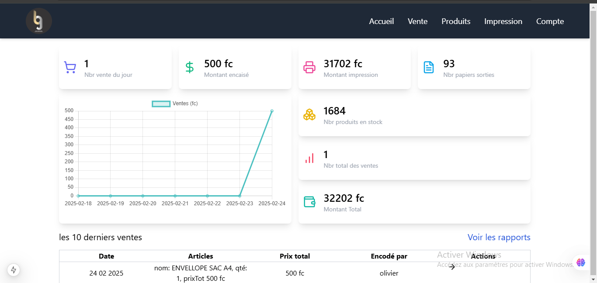

# BG Multi Services
##  This project is a single page application built with TypeScript, react, Next, Firebase and redux.

## Built With

- typescript
- React
- Postman
- NextJs 
- Redux
- Firebase
- Netlify

## Live Demo

[Live Demo Link](https://myweatherapplication-ts.netlify.app/)

## Getting Started

Here are the steps to follow in order to get this project on your local computer.

### Prerequisites

`node v20.13.1 +`

`npm v9.5.0 +`

### Setup

clone this repo by typing `git clone`

### Install

install the dependacies by typing `npm install`

### Usage

start the local server by running `npm run start`

### Deployment

this project is deployed on Netlify

to get the deployment build of the code run `npm run build`

### Testing

this project uses vitest from testing , to run the tests type `npm test` 

## Authors

👤 **Jospin Ndaano**

- Github: [@Jospin6](https://github.com/Jospin6)
- Linkedin: [@Jospin](https://www.linkedin.com/in/jospin-ndagano-8474b7267/)

## 🤝 Contributing

Contributions, issues and feature requests are welcome!

Feel free to check the [issues page](issues/).

## Show your support

Give a ⭐️ if you like this project!

## Acknowledgments

- Hat tip to anyone whose code was used
- Inspiration

## 📝 License

This project is [MIT](lic.url) licensed
